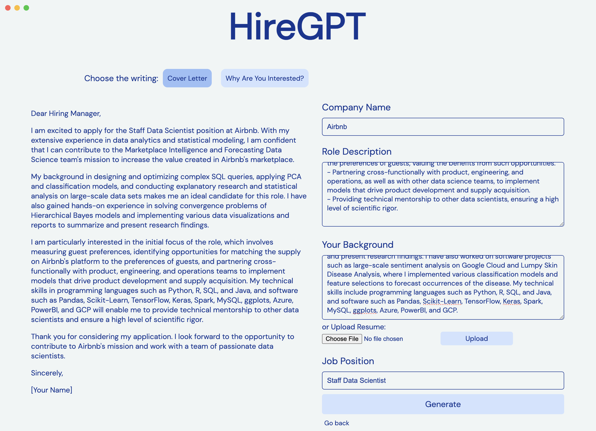

# HireGPT



No one (ever really) enjoys writing job applications 🙅🏻‍♂️ Just type in a few details like company name, your background, and job position, then the HireGPT will use OpenAI GPT model to generate the writings needed in your next job application (e.g. message to hiring manager, cover letter, etc).

❗️ NOTE: ChatGPT account required. You can login/sign-up for OpenAI API and get your API keys [here](https://platform.openai.com/docs/introduction).

# How to use

## 1 Install the app (⚠️ MacOS Only)
1. Go to Releases and download the `zip` file.
2. Unzip & run by clicking the `HireGPT` app.

## 2 Manual installation
Download the Github repo:
```
git clone https://github.com/jaejaywoo/HireGPT.git
```

Install all the necessary dependencies:
```
npm install
```

Run the app:
```
npm run start
```