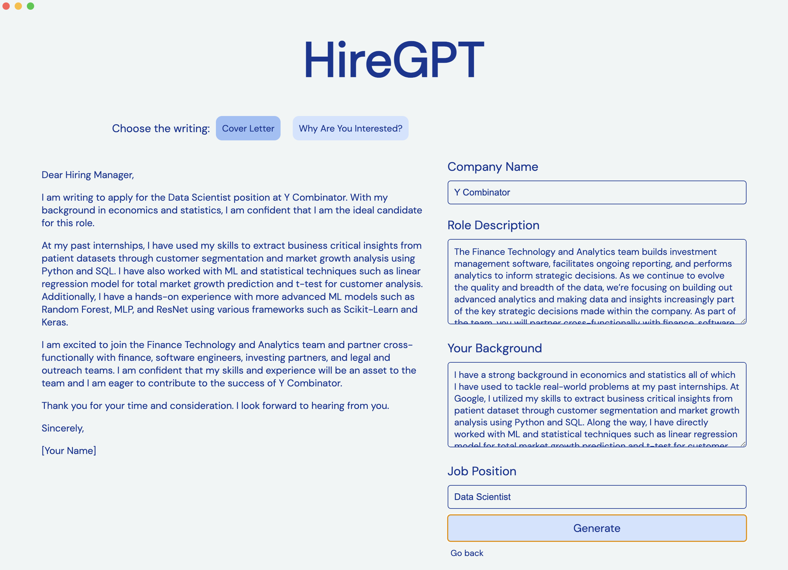

# HireGPT



No one (ever) enjoys writing job applications 🙅🏻‍♂️ Just type in a few details like company name, your background, and job position, then the HireGPT will use OpenAI GPT model to generate the writings needed in your next job application (e.g. message to hiring manager, cover letter, etc).

❗️ NOTE: ChatGPT account required.

# How to use

Download the Github repo:
```
git clone https://github.com/jaejaywoo/HireGPT.git
```

Install all the necessary dependencies:
```
npm install
```

Install Python dependencies:
```
pip install -r requirements.txt
```

Run Python backend server:
```
cd backend && flask run
```

Run the app:
```
npm run start
```